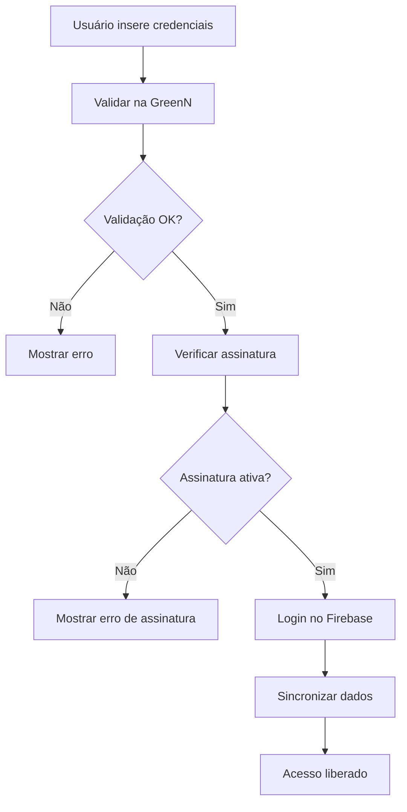

# 🎯 Guia de Integração com GreenN

## 📋 Visão Geral

Este guia explica como implementar a integração entre o Team HIIT e a plataforma GreenN para gerenciamento de assinaturas e autenticação híbrida.

## 🔧 Configuração Inicial

### 1. Variáveis de Ambiente

Crie um arquivo `.env` na raiz do projeto com as seguintes variáveis:

```env
# GreenN API Configuration
REACT_APP_GREENN_API_URL=https://api.greenn.com.br
REACT_APP_GREENN_API_KEY=sua_api_key_aqui
REACT_APP_GREENN_ENVIRONMENT=production

# Firebase Configuration (já existente)
REACT_APP_FIREBASE_API_KEY=sua_firebase_api_key
REACT_APP_FIREBASE_AUTH_DOMAIN=seu_dominio.firebaseapp.com
REACT_APP_FIREBASE_PROJECT_ID=seu_project_id
REACT_APP_FIREBASE_STORAGE_BUCKET=seu_storage_bucket
REACT_APP_FIREBASE_MESSAGING_SENDER_ID=seu_sender_id
REACT_APP_FIREBASE_APP_ID=seu_app_id
```

### 2. Instalação de Dependências

```bash
npm install axios
```

## 🚀 Implementação

### 1. Substituir o Sistema de Login

**Antes:**
```jsx
// src/App.jsx
import PWALogin from './components/PWALogin';

// No componente
<Route path="/form" element={<PWALogin onLogin={login} />} />
```

**Depois:**
```jsx
// src/App.jsx
import GreenNLogin from './components/GreenNLogin';

// No componente
<Route path="/form" element={<GreenNLogin />} />
```

### 2. Atualizar o Hook de Autenticação

**Antes:**
```jsx
// src/App.jsx
import { usePWAAuth } from './hooks/UsePWAAuth';

const { isAuthenticated, loading, login, logout } = usePWAAuth();
```

**Depois:**
```jsx
// src/App.jsx
import { useGreenNAuth } from './hooks/useGreenNAuth';

const { 
  isAuthenticated, 
  loading, 
  currentUser, 
  subscriptionStatus,
  login, 
  logout,
  hasFeatureAccess,
  isSubscriptionActive
} = useGreenNAuth();
```

### 3. Integrar Status da Assinatura no Dashboard

```jsx
// src/pages/Dashboard.jsx
import SubscriptionStatus from '../components/SubscriptionStatus';
import { useGreenNAuth } from '../hooks/useGreenNAuth';

function Dashboard() {
  const { subscriptionStatus } = useGreenNAuth();
  
  return (
    <div>
      {/* Conteúdo existente */}
      
      {/* Adicionar componente de status da assinatura */}
      <SubscriptionStatus 
        subscriptionStatus={subscriptionStatus}
        onUpgrade={() => {
          // Redirecionar para página de upgrade
          window.open('https://greenn.com.br/upgrade', '_blank');
        }}
      />
    </div>
  );
}
```

## 🔄 Fluxo de Autenticação

### 1. Login do Usuário



### 2. Verificação de Funcionalidades

```jsx
// Exemplo de uso no componente
const { hasFeatureAccess, isSubscriptionActive } = useGreenNAuth();

// Verificar acesso a funcionalidade específica
if (hasFeatureAccess('nutrition_tracking')) {
  // Mostrar funcionalidade de nutrição
}

// Verificar se assinatura está ativa
if (isSubscriptionActive()) {
  // Permitir acesso completo
}
```

## 📊 Estrutura de Dados

### 1. Dados do Usuário no Firestore

```javascript
{
  uid: "firebase_user_id",
  email: "user@example.com",
  displayName: "Nome do Usuário",
  greenNUserId: "greenn_user_id",
  subscriptionStatus: {
    isActive: true,
    plan: "premium",
    expiresAt: "2024-12-31T23:59:59Z",
    features: ["basic_workouts", "nutrition_tracking", "community_access"]
  },
  lastGreenNSync: "2024-01-15T10:30:00Z",
  createdAt: "2024-01-01T00:00:00Z"
}
```

### 2. Resposta da API GreenN

```javascript
{
  success: true,
  user: {
    id: "greenn_user_id",
    email: "user@example.com",
    name: "Nome do Usuário",
    createdAt: "2024-01-01T00:00:00Z"
  },
  subscription: {
    isActive: true,
    plan: "premium",
    expiresAt: "2024-12-31T23:59:59Z",
    features: ["basic_workouts", "nutrition_tracking", "community_access"]
  },
  accessToken: "jwt_token_aqui"
}
```

## 🎯 Planos e Funcionalidades

### Planos Disponíveis

| Plano | Preço | Funcionalidades |
|-------|-------|-----------------|
| Free | R$ 0 | Workouts básicos, Progresso |
| Basic | R$ 29,90/mês | + Nutrição, Comunidade |
| Premium | R$ 59,90/mês | + Workouts personalizados, Nutricionista |
| VIP | R$ 99,90/mês | + Coaching 1:1, Suporte prioritário |

### Funcionalidades por Plano

```javascript
const features = {
  free: ['basic_workouts', 'progress_tracking'],
  basic: ['basic_workouts', 'progress_tracking', 'nutrition_tracking', 'community_access'],
  premium: ['basic_workouts', 'progress_tracking', 'nutrition_tracking', 'community_access', 'personalized_workouts', 'nutritionist_access', 'advanced_analytics'],
  vip: ['basic_workouts', 'progress_tracking', 'nutrition_tracking', 'community_access', 'personalized_workouts', 'nutritionist_access', 'advanced_analytics', 'one_on_one_coaching', 'priority_support']
};
```

## 🔒 Segurança

### 1. Validação de Tokens

```javascript
// Verificar se o token da GreenN é válido
const isValidToken = (token) => {
  try {
    const decoded = jwt.verify(token, process.env.GREENN_JWT_SECRET);
    return decoded.exp > Date.now() / 1000;
  } catch (error) {
    return false;
  }
};
```

### 2. Rate Limiting

```javascript
// Implementar rate limiting para evitar abuso
const rateLimiter = {
  maxRequests: 100,
  windowMs: 15 * 60 * 1000, // 15 minutos
  message: 'Muitas tentativas. Tente novamente em 15 minutos.'
};
```

## 🧪 Testes

### 1. Testes Unitários

```javascript
// src/hooks/__tests__/useGreenNAuth.test.js
import { renderHook, act } from '@testing-library/react-hooks';
import { useGreenNAuth } from '../useGreenNAuth';

test('should login successfully with valid credentials', async () => {
  const { result } = renderHook(() => useGreenNAuth());
  
  await act(async () => {
    const response = await result.current.login('test@example.com', 'password123');
    expect(response.success).toBe(true);
  });
});
```

### 2. Testes de Integração

```javascript
// src/services/__tests__/GreenNIntegration.test.js
import greenNIntegration from '../GreenNIntegration';

test('should validate credentials with GreenN API', async () => {
  const result = await greenNIntegration.validateCredentials('test@example.com', 'password123');
  expect(result.success).toBe(true);
  expect(result.user).toBeDefined();
});
```

## 📱 Implementação no Mobile

### 1. Configuração do Capacitor

```javascript
// capacitor.config.json
{
  "plugins": {
    "GreenNPlugin": {
      "apiUrl": "https://api.greenn.com.br",
      "apiKey": "sua_api_key"
    }
  }
}
```

### 2. Plugin Nativo (Opcional)

```java
// android/app/src/main/java/com/teamhiit/app/GreenNPlugin.java
public class GreenNPlugin extends Plugin {
    @PluginMethod
    public void validateCredentials(PluginCall call) {
        String email = call.getString("email");
        String password = call.getString("password");
        
        // Implementar validação nativa
        // ...
    }
}
```

## 🚀 Deploy

### 1. Variáveis de Produção

```bash
# Configurar variáveis de ambiente no servidor
export REACT_APP_GREENN_API_URL=https://api.greenn.com.br
export REACT_APP_GREENN_API_KEY=sua_api_key_producao
export REACT_APP_GREENN_ENVIRONMENT=production
```

### 2. Build de Produção

```bash
npm run build
```

### 3. Deploy no Firebase Hosting

```bash
firebase deploy
```

## 📞 Suporte

### 1. Logs de Debug

```javascript
// Habilitar logs detalhados em desenvolvimento
if (process.env.NODE_ENV === 'development') {
  console.log('🔍 [GreenN] Debug mode enabled');
}
```

### 2. Monitoramento

```javascript
// Implementar monitoramento de erros
window.addEventListener('error', (event) => {
  if (event.error.message.includes('GreenN')) {
    // Enviar erro para serviço de monitoramento
    console.error('❌ [GreenN] Error:', event.error);
  }
});
```

## 🔄 Próximos Passos

1. **Configurar API da GreenN** - Obter credenciais e documentação
2. **Implementar autenticação híbrida** - Substituir sistema atual
3. **Testar integração** - Validar fluxo completo
4. **Deploy em produção** - Ativar integração
5. **Monitorar performance** - Acompanhar métricas

## 📚 Recursos Adicionais

- [Documentação da API GreenN](https://docs.greenn.com.br)
- [Firebase Authentication](https://firebase.google.com/docs/auth)
- [Capacitor Plugins](https://capacitorjs.com/docs/plugins)
- [React Hooks](https://reactjs.org/docs/hooks-intro.html)

---

**Nota:** Este guia assume que você tem acesso à API da GreenN e suas credenciais. Entre em contato com a equipe da GreenN para obter as informações necessárias.
